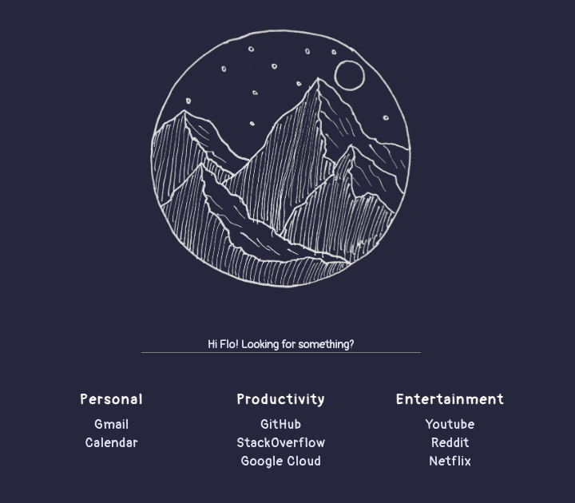

# simple-homepage

[](https://img.shields.io/github/v/release/fpgmaas/simple-homepage)
[](https://img.shields.io/github/workflow/status/fpgmaas/simple-homepage/merge-to-main)
[](https://fpgmaas.github.io/simple-homepage/)
[](https://github.com/psf/black)
[](https://pycqa.github.io/isort/)
[](https://img.shields.io/github/license/fpgmaas/simple-homepage)

`simple-homepage` is a command line utility that helps you create a simple static homepage for your browser. The documentation can be found [here](https://fpgmaas.github.io/simple-homepage/).

### Light ([Link to demo](https://fpgmaas.github.io/simple-homepage/demo/light/homepage.html))


### Dark ([Link to demo](https://fpgmaas.github.io/simple-homepage/demo/dark/homepage.html))



## Quick start

To get started, first install the package:

```
pip install simple-homepage
```

Then, navigate to a directory in which you want to create your homepage, and run

```
homepage init
```

or, for the dark version of the homepage:

```
homepage init --dark
```

Then, modify `settings.yaml` to your liking, and run

```
homepage build
```

Your custom homepage is now available under `public/homepage.html`.

## Acknowledgements

Inspiration for this project comes from [this](https://www.reddit.com/r/startpages/comments/hca1dj/simple_light_startpage/) post on Reddit by [/u/akauro](https://www.reddit.com/user/akauro/).

---

Repository initiated with [fpgmaas/cookiecutter-poetry](https://github.com/fpgmaas/cookiecutter-poetry).
