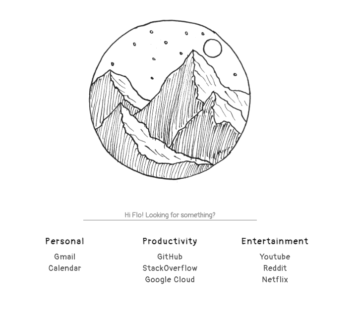
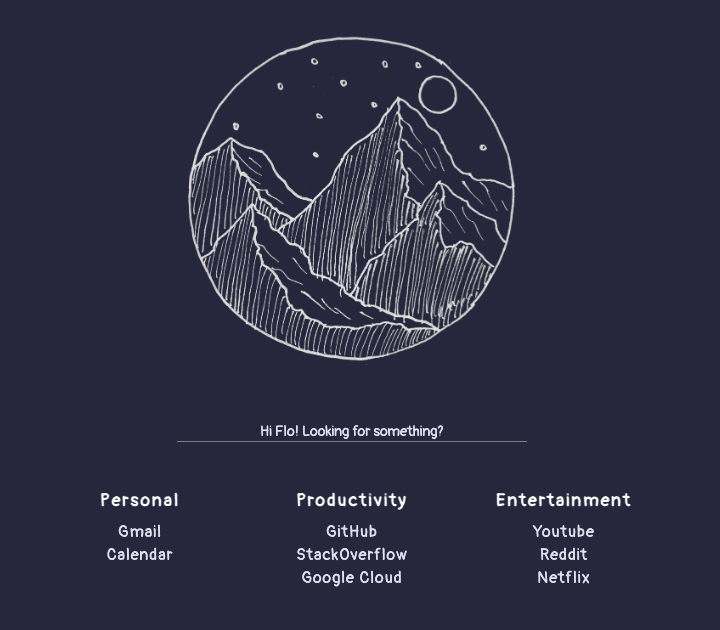

# simple-homepage

`simple-homepage` is a command line utility that helps you create a simple static homepage for your browser. For instructions on creating your own homepage, please refer to the `Getting Started` section in the sidebar.

### Light ([Link to demo](demo/light/homepage.html))

### Dark ([Link to demo](demo/dark/homepage.html))

## Acknowledgements

Inspiration for this project comes from [this](https://www.reddit.com/r/startpages/comments/hca1dj/simple_light_startpage/) post on Reddit by [/u/akauro](https://www.reddit.com/user/akauro/).

---